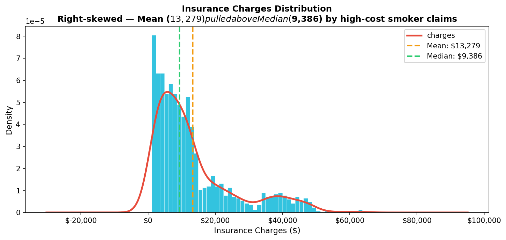
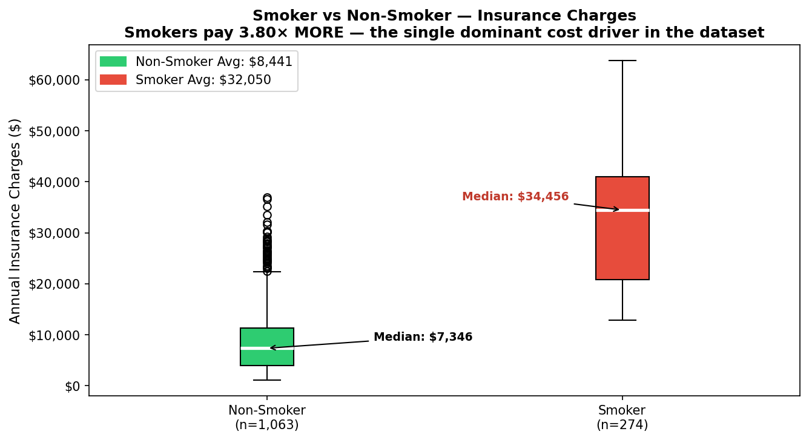
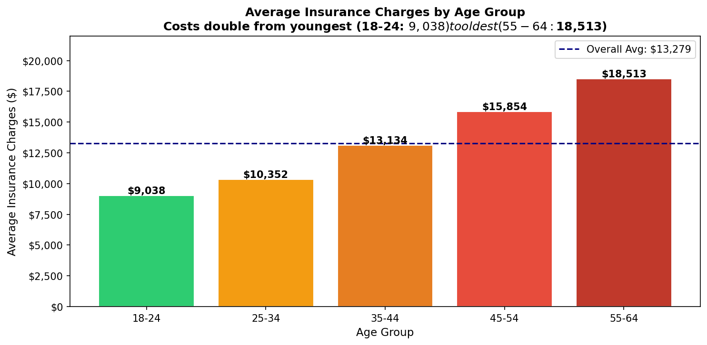
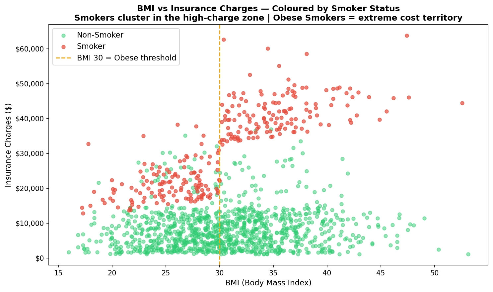
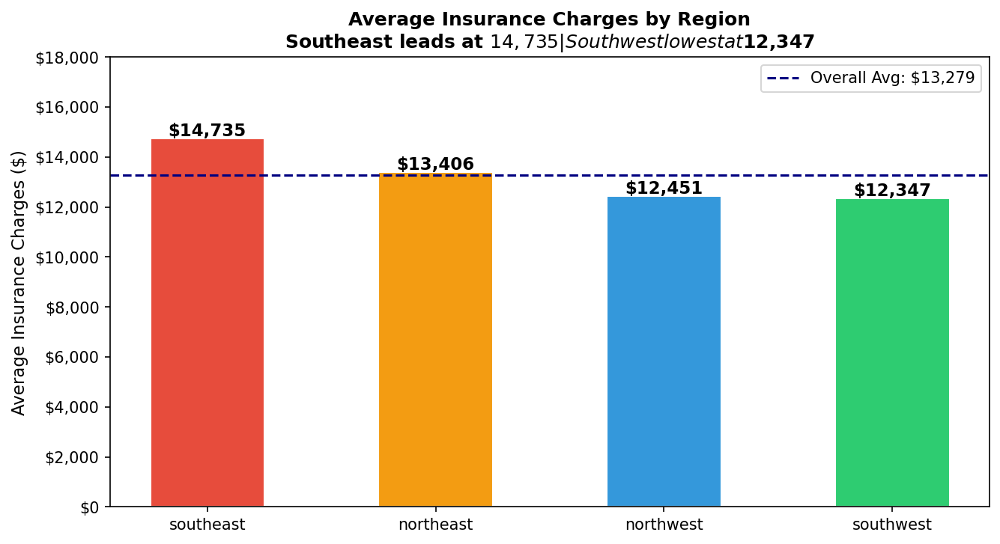
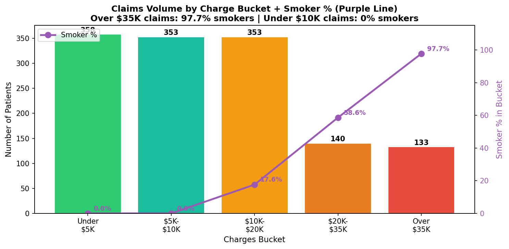
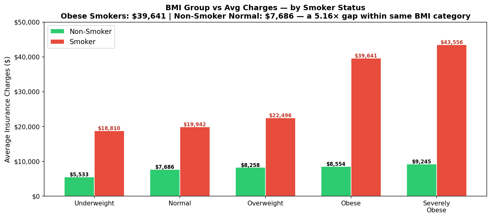
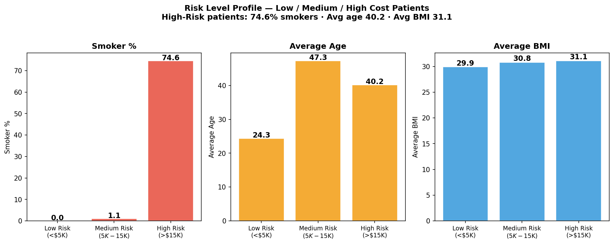
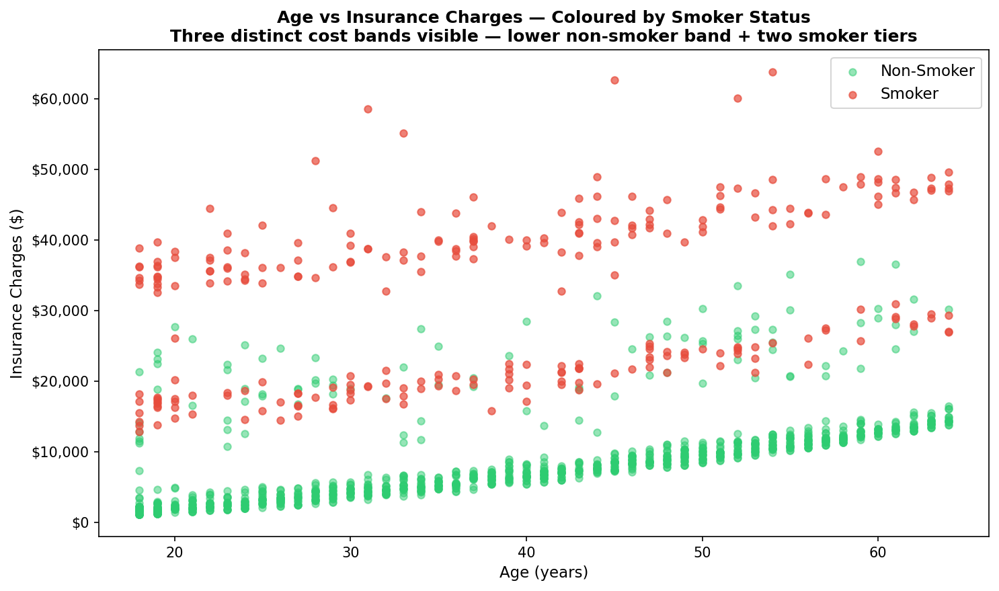
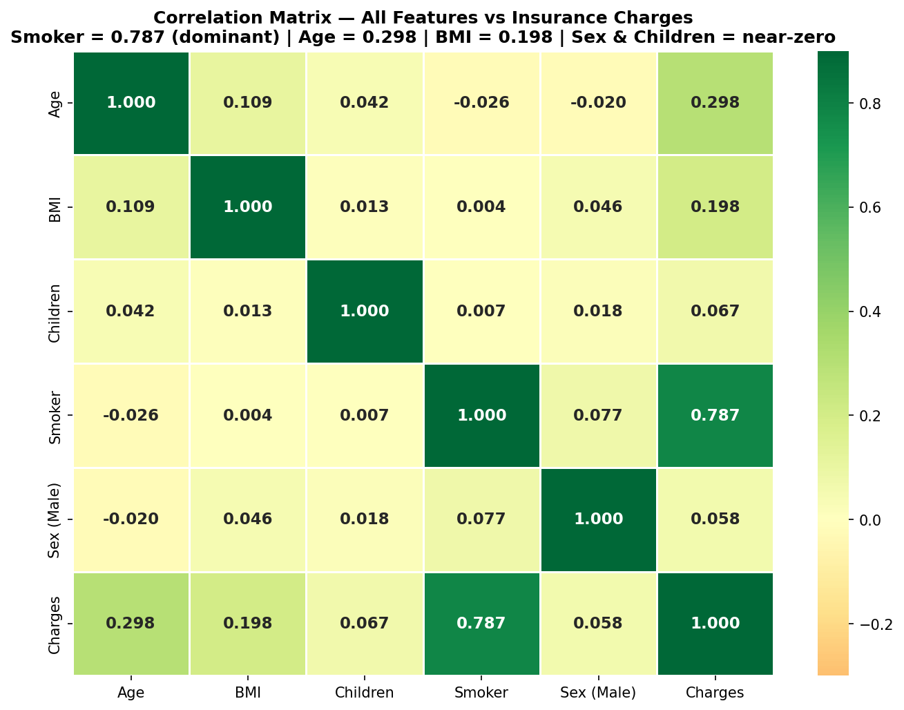

# Healthcare-Insurance-Claims-Cost-Risk-Analytics

# 🏥 Healthcare Insurance Cost Intelligence Dashboard
## Claims Analysis & Risk Segmentation


>Data Analytics Portfolio · Tools: Python + MySQL + Power BI Desktop
## 💰 Insurance Cost Intelligence Dashboard


---

## 📌 Project Overview

Executed a 3-phase end-to-end analytics pipeline on a 1,338-record medical insurance dataset — Phase 1 (Python): removed 1 duplicate row, engineered 5 boundary-safe derived features (AgeGroup, BMIGroup, ChargesBucket, RiskLevel, ChildrenGroup), and generated 10 EDA visualizations covering distribution, smoker impact, regional variation, and BMI×smoker interaction effects. • Phase 2 (MySQL): built a 7-column table with inline smoker Yes/No→1/0 conversion, 7 performance indexes, 7 validated analytical queries, and an 8-dimension analytical VIEW. • Phase 3 (Power BI): engineered 12 core DAX measures plus 3 weighted-average correction measures, and built a 3-page 28-visual dashboard surfacing that smokers pay **3.80× more** than non-smokers, and that Smoker + Severely Obese patients average **$43,556** — 5.80× the healthiest segment.

---

## 🎯 Problem Statement

A health insurer maintained 1,338 policyholder records across age, sex, BMI, dependents, smoking status, region, and annual charges with zero structured reporting layer. Underwriting teams had no quantified view of how smoking status interacted with BMI to compound cost risk, no mechanism to identify the exact multiplier smoking applied versus baseline demographics, and no segmented cost model despite a 56× spread between minimum ($1,122) and maximum ($63,770) charges — with no visualized explanation of why.

---

## 🎯 Objectives

- **Obj 1:** Execute a structured Python EDA pipeline — inspect, deduplicate, engineer 5 boundary-safe features, visualize 10 cost-risk dimensions
- **Obj 2:** Build a normalized MySQL table with inline smoker conversion, 7 indexes, and 7 validated analytical queries
- **Obj 3:** Create `vw_insurance_summary` VIEW aggregating 8 dimensions for Power BI segmentation
- **Obj 4:** Engineer DAX measures for smoker cost multiplier, risk segmentation, and weighted averages
- **Obj 5:** Build a 3-page 28-visual interactive dashboard covering claims overview, risk drivers, and patient segmentation
- **Obj 6:** Surface underwriting intelligence identifying highest-cost segments by smoking, BMI, age, and region

---

## 📁 Dataset

| Attribute | Detail |
|---|---|
| **Name** | Medical Cost Personal Insurance Dataset |
| **Source** | [Kaggle — mirichoi0218/insurance](https://www.kaggle.com/datasets/mirichoi0218/insurance) |
| **Format** | CSV (.csv) |
| **Raw Records** | 1,338 rows · 7 columns |
| **Clean Records** | 1,337 rows (1 exact duplicate removed) |
| **Null Values** | Zero — 100% complete |
| **Charges Range** | $1,121.87 – $63,770.43 (mean $13,279.12 · median $9,386.16) |
| **Smoker Split** | 274 Smokers (20.49%) · 1,063 Non-Smokers (79.51%) |
| **Regions** | 4 — Southeast (364) · Southwest (325) · Northwest (325) · Northeast (324) |

### Column Definitions

| Column | MySQL Type | Description |
|---|---|---|
| id | INT PRIMARY KEY | Auto-incrementing row identifier |
| age | TINYINT | Policyholder age (18–64) |
| sex | VARCHAR(10) | Female / Male |
| bmi | DECIMAL(5,2) | Body Mass Index |
| children | TINYINT | Number of dependents covered (0–5) |
| smoker | TINYINT(1) | 1=Smoker · 0=Non-Smoker (converted from yes/no) |
| region | VARCHAR(15) | southeast / southwest / northwest / northeast |
| charges | DECIMAL(10,2) | Annual medical insurance charges (USD) |

---

## 🛠️ Tools & Technologies

| Tool | Purpose |
|---|---|
| **Python 3.11** | Phase 1 — EDA, dedup, feature engineering, 10 chart generations, CSV export |
| **pandas / numpy** | `drop_duplicates()`, boundary-safe `pd.cut()` binning, groupby aggregation |
| **matplotlib / seaborn** | Histogram+KDE, box plots, scatter plots, correlation heatmap |
| **MySQL 8.0 + Workbench** | Table creation, `LOAD DATA INFILE`, 7 indexes, 7 queries, VIEW |
| **Power BI Desktop** | MySQL connection, DAX modelling, 3-page 28-visual dashboard |
| **DAX** | 12 core measures + 3 weighted-average correction measures |
| **JSON Theme File** | Healthcare Insurance Intelligence — Clinical Trust custom theme |

---

## ⚙️ Python EDA Process (10 Steps)

```
Step 01 → pd.read_csv('insurance.csv') — Shape (1338, 7) · 0 nulls confirmed
Step 02 → df.duplicated().sum() — 1 exact duplicate row found
Step 03 → df.drop_duplicates() — 1,337 clean rows confirmed
Step 04 → Engineered 5 derived columns using boundary-safe pd.cut()
           (half-integer age bins + right=False on BMI/charges/risk to match SQL BETWEEN exactly)
Step 05 → Chart 1 — Charges Distribution (Histogram+KDE): right-skewed, mean > median
Step 06 → Chart 2 — Smoker vs Non-Smoker Box Plot: 3.80× multiplier visualized
Step 07 → Charts 3-5 — Age bar, BMI scatter, Region bar
Step 08 → Charts 6-9 — Bucket distribution, BMI×Smoker, Risk profile, Age scatter
Step 09 → Chart 10 — Correlation Heatmap: Smoker=0.787 dominant driver
Step 10 → df_export.to_csv('insurance_cleaned.csv') — 1,337 rows exported
```
## 📈 Exploratory Data Analysis (EDA)

### Distribution of Insurance Charges


### Charges by Smoking Status


### Charges by Age Group


### BMI vs Charges


### Charges by Region


### Charges by Bucket & Smoking Status


### BMI, Smoking & Charges


### Risk Level Profile


### Age vs Charges


### Correlation Heatmap

---

## 🗄️ MySQL Process (13 Steps)

```
Step 01 → CREATE TABLE insurance_claims (7 columns + auto id PK)
Step 02 → LOAD DATA INFILE with SET smoker = IF(@raw='yes',1,0)
           1,337 rows loaded · 0 skipped (1,024 truncation warnings = expected decimal rounding)
Step 03 → SELECT COUNT(*) — 1,337 confirmed
Step 04 → SELECT smoker, COUNT(*) GROUP BY smoker — 0=1,063 · 1=274 confirmed
Step 05 → Created 7 indexes (smoker, region, sex, age, bmi, charges, children)
Step 06 → Query 1 — Overall KPIs: 1,337 patients · $13,279.12 avg · 20.49% smokers
Step 07 → Query 2 — Smoker vs Non-Smoker: $32,050.23 vs $8,440.66
Step 08 → Query 3 — Charges by Region: Southeast highest at $14,735.41
Step 09 → Query 4 — Charges by Age Group: 18-24 $9,037.95 → 55-64 $18,513.28
Step 10 → Query 5 — Charges by BMI Group: Normal $10,409.34 → Severely Obese $16,953.82
Step 11 → Query 6 — Risk Level: High Risk 358 patients · 74.58% smokers
Step 12 → Query 7 — Smoker×BMI: Severely Obese Smoker $43,556.40 (highest)
Step 13 → CREATE VIEW vw_insurance_summary — 8-dimension aggregation for Power BI
```

---

## 📐 DAX Measures Created

```dax
Total Patients = COUNTROWS(insurance_claims)
-- Result: 1,337

Avg Charges = AVERAGE(insurance_claims[charges])
-- Result: $13,279.12

Smoker Avg Charges = CALCULATE([Avg Charges], insurance_claims[smoker] = 1)
-- Result: $32,050.23

NonSmoker Avg Charges = CALCULATE([Avg Charges], insurance_claims[smoker] = 0)
-- Result: $8,440.66

Smoker Cost Multiplier = DIVIDE([Smoker Avg Charges], [NonSmoker Avg Charges])
-- Result: 3.80×

High Risk % = DIVIDE([High Risk Patients], [Total Patients]) * 100
-- Result: 26.78%
```

**Weighted-average correction measures** (fixes VIEW pre-aggregation inflation — see Challenges):

```dax
VIEW Weighted Avg Charges =
DIVIDE(
    SUMX(vw_insurance_summary, vw_insurance_summary[avg_charges] * vw_insurance_summary[total_patients]),
    SUM(vw_insurance_summary[total_patients])
)
```

---

## 📊 Dashboard Visuals — 28 Visuals Across 3 Pages

### Page 1 — Claims Overview
6 KPI cards · Patient Count by Charges Bucket · Avg Charges by Region · Smoker vs Non-Smoker donut (20.49%/79.51%) · Region + Sex slicers.

### Page 2 — Risk Driver Analysis
Smoker vs Non-Smoker Avg Charges · Avg Charges by Sex · Avg Charges by BMI Group · BMI×Smoker Combination · Avg Charges by Age Group · Risk Level donut (358/621/358) · BMI Group + Smoker Status slicers.

### Page 3 — Patient Segmentation
4 KPI cards · Risk Level Summary Table · Avg Charges by Number of Children · Avg Charges by Region×Smoker Status · Age Group + Region slicers.

---

## 📈 Key Insights & Results

### A. Smoking Status — The Dominant Cost Driver
- Smokers represent only **20.49%** of the book (274 of 1,337) yet average **$32,050.23** annually — **3.80×** the non-smoker average of $8,440.66.
- Smoking correlates with charges at **0.787** — more than double the combined explanatory power of age (0.298) and BMI (0.198).
- Claims over $35,000 are **97.7% smokers**; claims under $10,000 are **0% smokers**.

### B. BMI × Smoking — The Compounding Effect
- **Worst segment:** Smoker + Severely Obese (BMI≥35) — 71 patients averaging **$43,556.40**.
- **Best segment:** Non-Smoker + BMI<25 — 190 patients averaging **$7,515.71** — a **5.80×** gap.
- Within non-smokers, BMI has minimal cost impact (1.67× spread). Within smokers, the same BMI range produces a **2.32×** spread — obesity is a cost multiplier only in the presence of smoking.

### C. Regional Variation
- Southeast leads at **$14,735.41** average charges — also the highest smoker concentration at **25.00%** (91 of 364), directly explaining its premium over Southwest ($12,346.94, 17.85% smokers).

### D. Age & Risk Segmentation
- Charges rise from **$9,037.95** (18–24) to **$18,513.28** (55–64) — a 104.8% increase.
- The 358 Low-Risk patients contain **zero smokers**; the 358 High-Risk patients are **74.58% smokers** — smoking status alone nearly determines risk-tier membership.

---

## 📊 KPI Summary Table

| KPI | Value | KPI | Value |
|---|---|---|---|
| Total Patients | **1,337** | Avg Charges | **$13,279.12** |
| Min / Max Charges | $1,121.87 / $63,770.43 | Median Charges | $9,386.16 |
| Smoker Avg Charges | **$32,050.23** | Non-Smoker Avg Charges | $8,440.66 |
| Smoker Cost Multiplier | **3.80×** | Smoker % | 20.49% (274 of 1,337) |
| Highest Region | Southeast — $14,735.41 | Lowest Region | Southwest — $12,346.94 |
| Age 18-24 Avg | $9,037.95 | Age 55-64 Avg | $18,513.28 (+104.8%) |
| Normal BMI Avg | $10,409.34 | Severely Obese Avg | $16,953.82 (+62.9%) |
| Worst Segment | Smoker + Severely Obese — **$43,556.40** | Best Segment | Non-Smoker + BMI<25 — $7,515.71 |
| Low Risk Patients | 358 (26.78%) — 0% smokers | High Risk Patients | 358 (26.78%) — 74.58% smokers |
| Correlation — Smoker | **0.787** | Correlation — Age / BMI | 0.298 / 0.198 |

---

## ⚡ Challenges & Solutions

**Challenge 1 — Matplotlib Mathtext Crash on Chart Titles**
Titles with 2+ unescaped `$` signs were silently parsed as LaTeX math mode, garbling text or crashing outright when a "%" appeared inside the math region. • Escaped every `$` with `\$` across all 5 affected titles after reproducing and confirming the fix in isolation first.

**Challenge 2 — pd.cut() Boundary Misclassification**
Default right-inclusive `pd.cut()` bins silently misclassified integer boundary values (age 25/35/45/55, BMI 30.0) relative to MySQL's `BETWEEN` logic — affecting 100+ patients on the age dimension alone. • Rewrote age bins with half-integer edges and applied `right=False` to BMI/charges/risk bins for exact SQL parity.

**Challenge 3 — VIEW Aggregation Inflation in Power BI**
Charts built on `vw_insurance_summary[avg_charges]` showed values in the millions instead of thousands, because Power BI's default SUM added dozens of pre-computed per-segment averages together rather than computing one true average — affecting 7 of 28 visuals. • Added 3 weighted-average DAX measures using `SUMX(avg×count)/SUM(count)` and replaced the raw VIEW column in all 7 affected visuals.

**Challenge 4 — MySQL Data Truncation Warnings**
`LOAD DATA INFILE` returned 1,024 "Data truncated" warnings for `bmi` and `charges`, appearing alarming despite `Records: 1337 Skipped: 0`. • Confirmed as expected behavior — source decimals (e.g. `21984.47061`) exceed the intentional `DECIMAL(10,2)` currency schema, so MySQL rounds and warns rather than rejecting rows.

**Challenge 5 — Power BI Table Database Prefix**
MySQL connector loaded tables as `insurance_project insurance_claims`, breaking every DAX measure. • Renamed both tables in Power Query before writing any DAX — the same fix pattern applied across every MySQL-sourced project in this portfolio.

---

## 🎓 Skills Learned

- **Boundary-Safe Feature Engineering** — `pd.cut()`'s right-inclusive default can silently diverge from SQL `BETWEEN`; half-integer edges or `right=False` are required for exact cross-tool consistency
- **Matplotlib Text Rendering Internals** — unescaped `$` pairs trigger mathtext parsing in any Artist text; a "%" inside the math region escalates a silent bug into a hard crash
- **Pre-Aggregated VIEW Pitfalls** — a VIEW grouped by multiple dimensions cannot be safely SUM'd or AVERAGE'd in a BI tool without a weighted-average correction
- **Interaction-Effect Analysis** — quantified that BMI's cost impact is conditional on smoking status (1.67× vs 2.32× spread) — a genuine statistical interaction, not two additive factors
- **Cross-Tool Pipeline Debugging** — traced bugs from symptom (garbled title, inflated KPI) back to root mechanism across three different tools in the same pipeline

---

## 🎨 Custom Theme

| Attribute | Detail |
|---|---|
| **Theme Name** | Healthcare Insurance Intelligence — Clinical Trust |
| **Style** | 🌊 Dark — Teal-Navy + Emerald Primary |
| **Primary Accent** | #14B8A6 (Teal/Emerald) — health + trust |
| **Risk Color** | #EF4444 (Red) — smoker / high-risk indicators |
| **Safe Color** | #22C55E (Green) — non-smoker / low-risk |
| **Neutral Color** | #F59E0B (Amber) — medium-risk |
| **Background** | #0A1F2E (Deep Teal-Navy) |
| **Best For** | Healthcare, insurance, InsurTech dashboards |

**To apply:** Power BI → View → Themes → Browse for themes → select `Healthcare_Insurance_Clinical_Trust_Theme.json`

---

## 📂 Repository Structure

```
healthcare-insurance-cost-analytics/
│
├── 📊 Insurance_Cost_Intelligence_Dashboard.pbix   # Power BI dashboard file
├── 📁 Dataset/
│   └── insurance.csv                               # Raw source data (Kaggle)
├── 📁 Python/
│   ├── insurance_eda.py                            # Python EDA + visualization script
│   └── insurance_cleaned.csv                       # Cleaned export for MySQL
├── 📁 MySQL/
│   └── insurance_queries.sql                       # All SQL: CREATE, IMPORT, 7 queries, VIEW
├── 📁 Charts/
│   └── chart1-10_*.png                             # 10 Python EDA charts
├── 📁 Theme/
│   └── Healthcare_Insurance_Clinical_Trust_Theme.json
├── 📄 Insurance_Cost_Intelligence_Documentation.pdf # Full portfolio documentation
└── 📄 README.md
```
---

*Data Analytics · Healthcare Insurance Cost Intelligence · K.S.*
